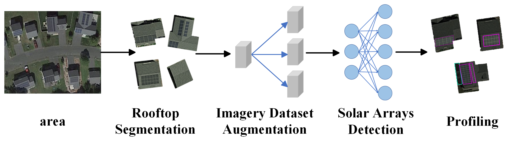

# SolarDetector

Due to the intermittent nature of solar energy, it has been increasingly challenging for the utilities, third-parties, and government agencies to integrate distributed energy resources generated by rooftop solar photovoltaic (PV) arrays into smart grids. Recently, there is a rising interest in automatically collecting solar installation information in a geospatial region that are necessary to manage this stochastic green energy, including the quantity and locations of solar PV deployments, and their profiling information. Most recent work focuses on using big aerial or satellite imagery data to train machine learning or deep learning models to automatically detect solar PV arrays. Unfortunately, these approaches are suffering low detection accuracy due to insufficient sample and feature learning when building their models and the separation of rooftop object segmentation and identification during their detection process. In addition, most recent approaches cannot report accurate multi-deployment detection results. 

To address these problems, we design a new approach---SolarDetector, which can automatically and accurately detect and profile distributed solar photovoltaic arrays in a given geospatial region without any extra cost. In essence, we first leverage multiple data augmentation techniques (e.g., CycleGAN, latent diffusion models (LDMs), and Generative Adversarial networks (GANs)), to build a large rooftop satellite imagery dataset (RSID). Then, SolarDetector employs Mask R-CNN algorithm to accurately identify rooftop solar arrays and learn the detailed installation information for each solar array simultaneously. In addition, SolarDetector could also integrate with large-scale data processing engine---Apache Spark, and graphics processing units (GPUs) to further improve its training cost. We evaluate our new big dataset---RSID using large public satellite images.  We evaluate SolarDetector using  272,989 public satellite images dataset from the  U.S., China, and France. We find that pre-trained SolarDetector yields an average MCC of 0.862 to detect solar PV arrays over  RSID, which is 50$\% better than the most notable approach—SolarFinder. In addition, unlike prior work, we show that SolarDetector$^{+}$ can also accurately profile the detected rooftop objects.
